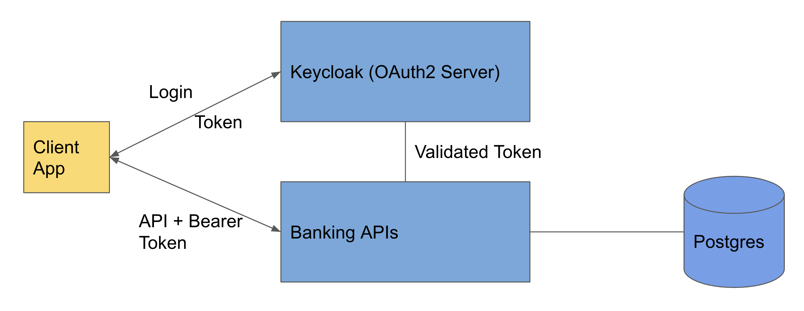
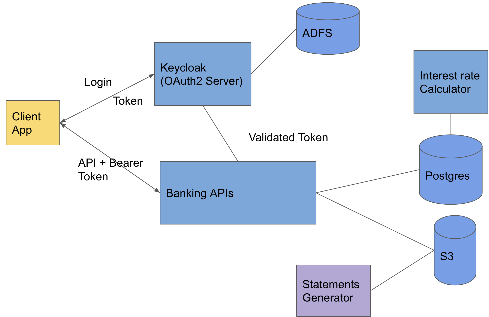
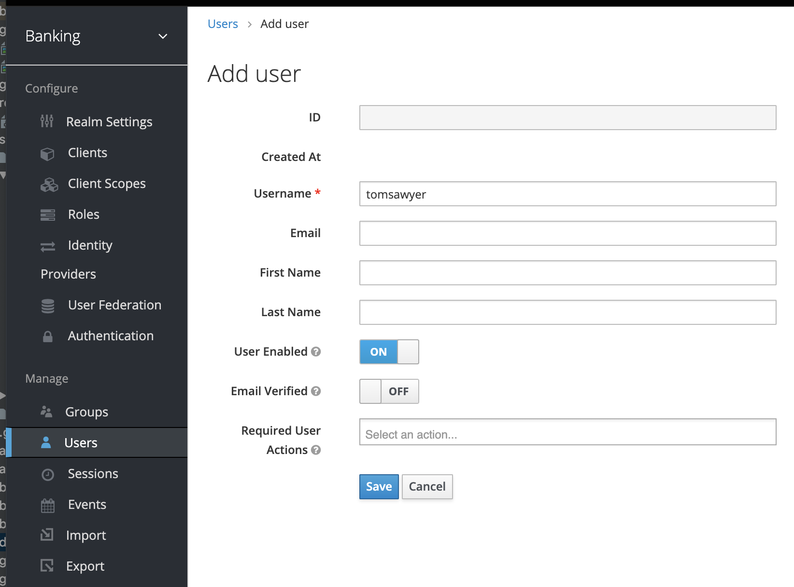
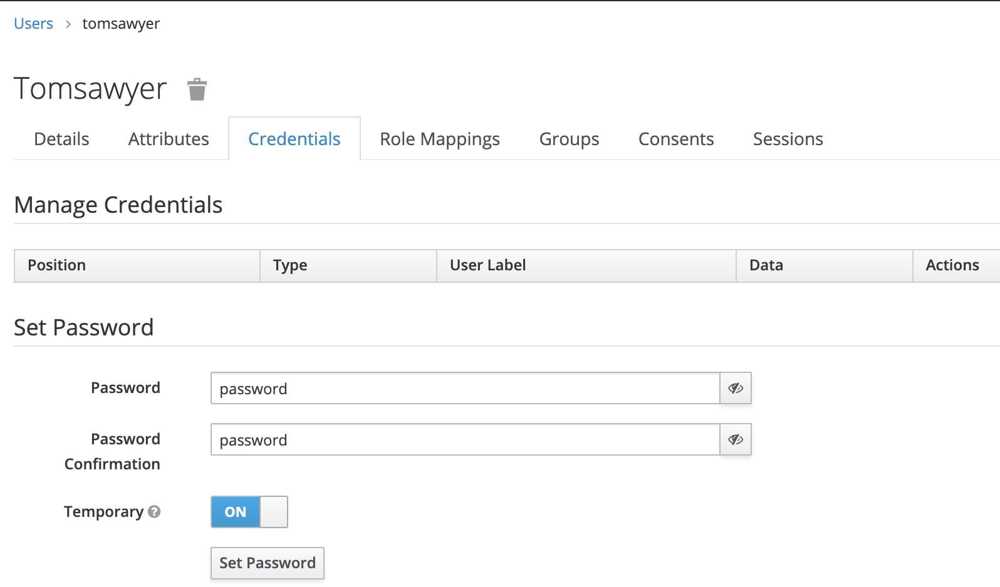
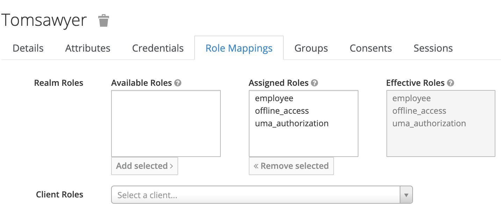

# Getting Started

## Current Architecture

Keycloak is our OAuth2 Server.
Employees are stored in Keycloak (They need to have 'employee' role to access Banking apis)

Banking apis is a monolithic application (for now) which uses postgres for storage.
## Future Architecture


Ideally the architecture should be split as below. I have built one application with everything inside in the interest of time.

* Statements can be generated offline and stored in an object store such as S3, so they will be ready when user asks for it.
* Interest rate calculator can be run on its own background process.
* Keyclock should be backed with an identity provider such as ADFS. 

## Schema

Customer table contains the customer related information
### Customer table
| id | firstName | lastName | address | kycPhone | kycProofOfAddress |
| ------ | ------ | ------ | ------ | ------ | ------ |
| 1 | Tom | Sawyer | 1 Main Street, Framingham | 4646446456 | 575757557 |
 
Accounts table contains the account related information 
### Account table
| id | accountNumer | type |  currentBalance | beginningBalance | 
| ------ | ------ | ------ | -------- | -------- |
| 24 | 1243252 | Savings | 1029.78 | 2635.12 |

Customer Accounts tables maps Customer(s) to Account(s)  
### Customer Accounts (Join table)
| customer_id | account_id |
| ------ | ------ |
| 1 | 2 |

##Running application locally

### Step 1 - Run the services
```docker-compose.yml up```

This starts keycloak (and it's MySQL database) and a postgres database used by the Banking apis

Keycloak container needs vulnes, you may have to setup your local docker host to allow this.
### Step 2 -  Run the application
```.gradlew clean bR```

This will run the application and connect to postgres database run in step 1
 
Application runs on post 8081

To run the application in dev mode, run with 'dev' profile (TODO)
### Step 3 Setup Keycloak
By default Keycloak will have
* banking realm 
* login app
#### Step 3.1 - Add employees to Keycloak

Set username and click on save
#### Step 3.2 - Set password for employee
Set password, keep the password for later usr

#### Step 3.3 - Set user with role = employee
Add ```employee``` to assigned role and click on save. After save, it should look like below:


### Step 4 Making api call(s)
#### Step 4.1 - Create token
* Use ```Get token for user``` from postman (make sure you have the right client_secret as in keycloak)
* Copy the ```access_token``` field
#### Step 4.2 - Make api call
* Set HTTP header: ```Authorization: bearer {access_token from above}```
* Make ```Get all customers``` api call

## Functionality not completely done
I ran into errors with logout functionality (TODO) 
 
## Wish list
I did not have time to add the following. I added TODO comments in the code for it
* Application metrics as in [my blog](https://phani-susarla.medium.com/telemetry-spring-boot-apps-ea48a6f9bc0d)
* Detailed logging 
* Custom Exceptions
* Validating all input fields
* Create request objects separate from entity objects

