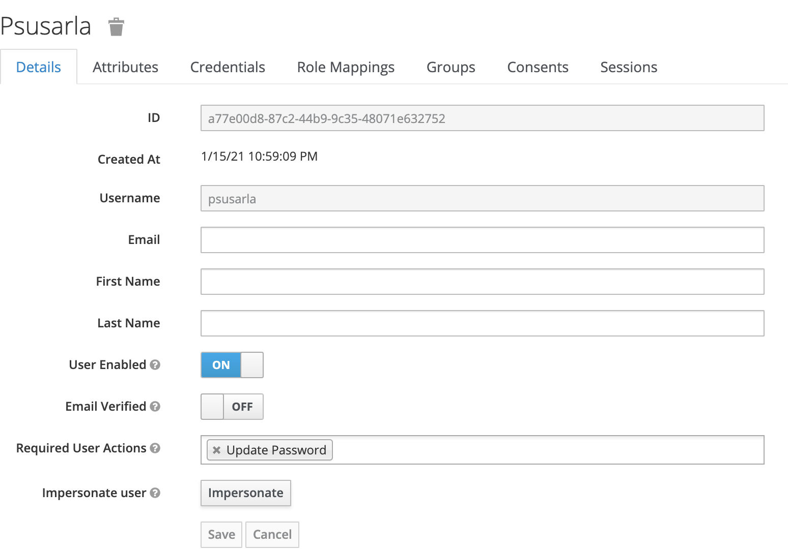
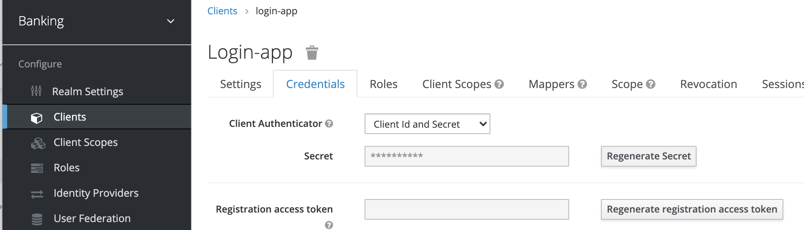

# Getting Started

## Current Architecture

Keycloak is our OAuth2 Server.

Employees will be stored as users in Keycloak (They need to have 'employee' role to access Banking apis)

Banking apis is a monolithic application (for now) which uses postgres for storage.
## Future Architecture


Ideally the architecture should be split as below. I have built one application with everything inside in the interest of time.

* Statements can be generated offline and stored in an object store such as S3, so they will be ready when user asks for it.
* Interest rate calculator can be run on its own background process. Quartz scheduler is better option than Spring scheduler.
* Keyclock should be backed with an identity provider such as ADFS. 

## APIs
Please refer to postman collection for sample requests

#### GET /customer
Gets all customers
#### GET /customer/{customerId}
Gets a customer
#### PUT /customer/{customerId}
Updates a customer
#### POST /customer
Creates a customer
#### GET /account
Gets all accounts
#### GET /account/{accountId}
Gets an account
#### PUT /account/{accountId}
Updates an account
#### POST /account
Creates an account
### /account/transfer/from/{fromAccountId}/to/{toAccountId}?amount={amount}
Transfers Amount
In case of failures, client should show the current balances to user and ask if it can be retried
### GET /account/{accountId}/statement
Get account statement
### PUT /customer/{customerId}/kyc
Update KYC for a customer 
### /customer/logout
Logs out user
### /customer/link/{customerId}/account/{accountId}
Link an Account to Customer
## Background Job
Interest rate background job runs Dec 25th every year by default.

The cron schedule can be overridden using below property:
```aidl
interest:
  calculator:
    schedule: "*/60 * * * * *"
```
## Schema

Customer table contains the customer related information
### Customer table
| id | firstName | lastName | address | kycPhone | kycProofOfAddress |
| ------ | ------ | ------ | ------ | ------ | ------ |
| 1565 | Tom | Sawyer | 1 Main Street, Framingham | 4646446456 | 575757557 |
 
Accounts table contains the account related information 
### Account table
| id | accountNumer | type |  currentBalance | beginningBalance | 
| ------ | ------ | ------ | -------- | -------- |
| 24383 | 1243252 | Savings | 1029.78 | 2635.12 |

Customer Accounts tables maps Customer(s) to Account(s)  
### Customer Accounts (Join table)
| customer_id | account_id |
| ------ | ------ |
| 1565 | 24383 |

##Running application locally
Clone the git repo

### Step 1 - Run the services
```docker-compose.yml up```

This starts keycloak (and it's MySQL database) and a postgres database used by the Banking apis

Keycloak container needs volumes, you may have to setup your local docker host to allow this.
### Step 2 -  Run the application
```.gradlew clean bR```

This will run the application and connect to postgres database run in step 1
 
Application runs on post 8081

To run the application without security run 
```./gradlew clean bootRun --args='--spring.profiles.active=no-auth'```

```postman-collections``` has sample api calls

Follow the below steps if you are running in secure mode
### Step 3 Setup Keycloak
Login to keycloak at http://localhost:8180 (username: admin, password: Pa55w0rd)
By default Keycloak will have
* banking realm 
* login app (under clients)
#### Step 3.1 - Add employee to Keycloak
Make sure you are under Banking realm, click on ```Add User```

Set username and click on save
#### Step 3.2 - Set password for employee
Set password, keep the password for later use

#### Step 3.3 - Set user with role = employee
Add ```employee``` to assigned role and click on save. After save, it should look like below:

#### Step 3.4 - Remove 'update password'

Remove ```Update Password``` from ```Required User Actions``` and click on save
#### Step 3.5 - Set client secret
Go to keycloak and click on ```Regenerate Secret```

Copy the secret for below step
#### Step 3.6 - Generate Access Token
* Use ```Get token for user``` from postman (make sure you have the right client_secret as in keycloak)
* Copy the ```access_token``` field

### Make api call
* Set HTTP header: ```Authorization: bearer {access_token from above}```
* Make ```Get all customers``` api call

## Known Issues

### Join table error
When you the run the Spring Boot App first time, you will run into below error:
```Caused by: org.postgresql.util.PSQLException: ERROR: relation "customer_accounts" does not exist```
This error will disappear from second time onward
### Logout functionality
Although the Banking api logout was implemented, keycloak logout of the access token is still not working. 
 
## Wish list
I did not have time to add the following. I added TODO comments in the code for it
* Application metrics as in [my blog](https://phani-susarla.medium.com/telemetry-spring-boot-apps-ea48a6f9bc0d)
* Detailed logging 
* Custom Exceptions
* Validating all input fields
* Separate request objects from entity objects
* Keycloak realm with hardcoded client secret and other setup so the local setup is not so tedious

